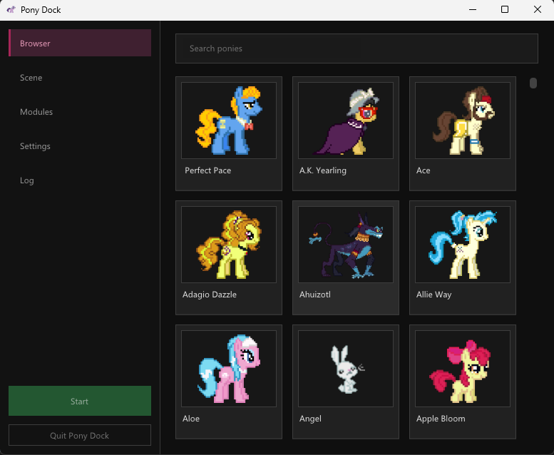

# Pony Dock

This is a reimplementation of [Desktop Ponies](https://github.com/RoosterDragon/Desktop-Ponies). The sprites come from that project. see [License](#license).

Animated ponies walk around on your Windows desktop. A control panel picks which ones show up and how they behave.



## Details for nerds

Behavior is Lua; the C++ side only draws sprites and keeps time. A module is a file under `Scripts/` returning a table with `spawn(self)` and `tick(self, dt)`. `self` is per entity and survives between ticks, so state lives on it. The host writes position, size, facing and whether the pony is hovered or dragged onto `self` before each tick, then reads `x` and `y` back. `self.pack` is the pony's behavior data, read-only. `self:play(name, loop)`, `self:set_facing("left")`, `self:setting(id)` and `self:log(message)` do the rest.

Modules declare their own controls, which appear in the Modules view:

```lua
settings.slider("speed", "Speed multiplier", 1.0, 0.1, 4.0)
```

`self:setting("speed")` reads it back, globally or per pack. Script errors land in the Log view with a traceback instead of killing the app, and scripts reload without a restart. `core.lua` is the default module: weighted pick, linked behaviors, bounce at the edge, etc.

### Building

MSVC (Visual Studio 2026 or the build tools) with the C++ workload, CMake 3.28 or newer, and Ninja are required.

```
git clone --recurse-submodules https://github.com/kuningashallinta/Pony-Dock.git
cd Pony-Dock
cmake --preset x64-Release
cmake --build --preset x64-Release
```

vcpkg is a submodule and builds nlohmann-json, EnTT, stb, Lua and sol2 on the first configure, so expect that step to take a while. Dear ImGui is vendored as well, on the docking branch.

The overlay is a click-through layered window over the virtual desktop, taking clicks only while the cursor is on a pony. `Packs/` and `Scripts/` are copied next to `Client.exe` after every build and loaded from there, so the build output already has the layout a release needs.

## License

Pony Dock is licensed under [Apache 2.0](LICENSE). Artwork stays under [CC BY-NC-SA 3.0](https://creativecommons.org/licenses/by-nc-sa/3.0/), which makes `Packs/` non-commercial and share-alike. [CREDITS.md](CREDITS.md).
